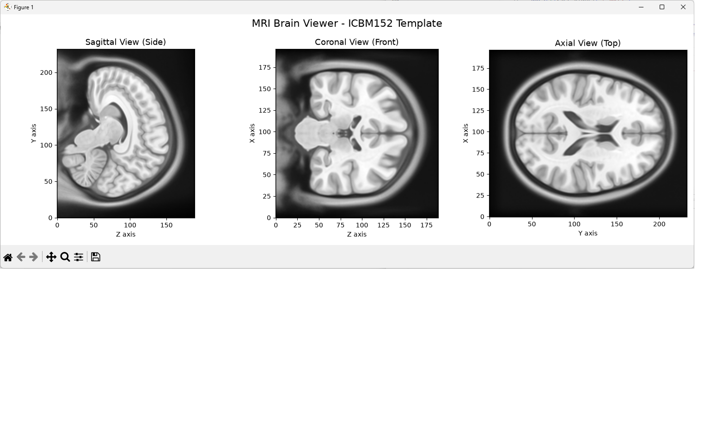
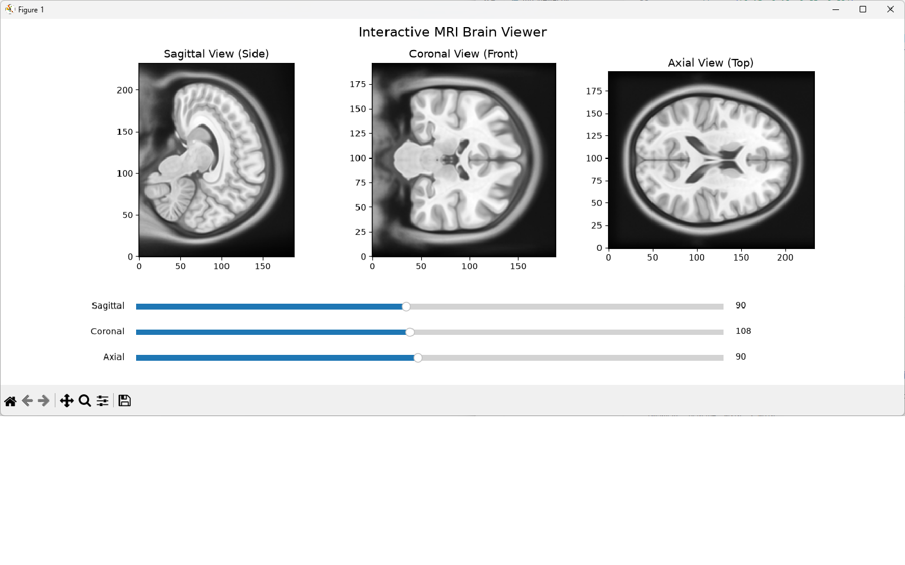

# MRI Brain Viewer 🧠

A Python-based MRI brain scan visualizer that loads real neuroimaging data and displays it in three anatomical views.

Built as part of my MSc Medical Systems Engineering studies at Otto von Guericke University, Magdeburg.

## What it does

### Static Viewer (mri_viewer.py)
- Loads a real human brain MRI scan (ICBM152 template)
- Displays 3 standard medical views:
  - **Sagittal** (Side view)
  - **Coronal** (Front view)
  - **Axial** (Top view)

### Interactive Viewer (mri_interactive.py)
- Everything above PLUS
- 3 interactive sliders to scroll through all brain slices in real time
- Updates all 3 views simultaneously as you move the sliders
- Similar concept to professional medical imaging software like 3D Slicer

## Technologies Used

- Python 3.13
- nibabel for reading NIfTI MRI file formats
- matplotlib for visualization
- nilearn for sample neuroimaging data
- numpy for data processing

## How to Run

Step 1 - Clone this repository

Step 2 - Install dependencies by running this in terminal:

pip install nibabel matplotlib nilearn numpy

Step 3 - Run the script:

python mri_viewer.py

## Output

Three anatomical views of a real human brain MRI scan displayed in grayscale.

## Author

Kuljit Singh - MSc Medical Systems Engineering
Otto von Guericke University, Magdeburg, Germany
LinkedIn: https://www.linkedin.com/in/kuljit-singh-021252197/